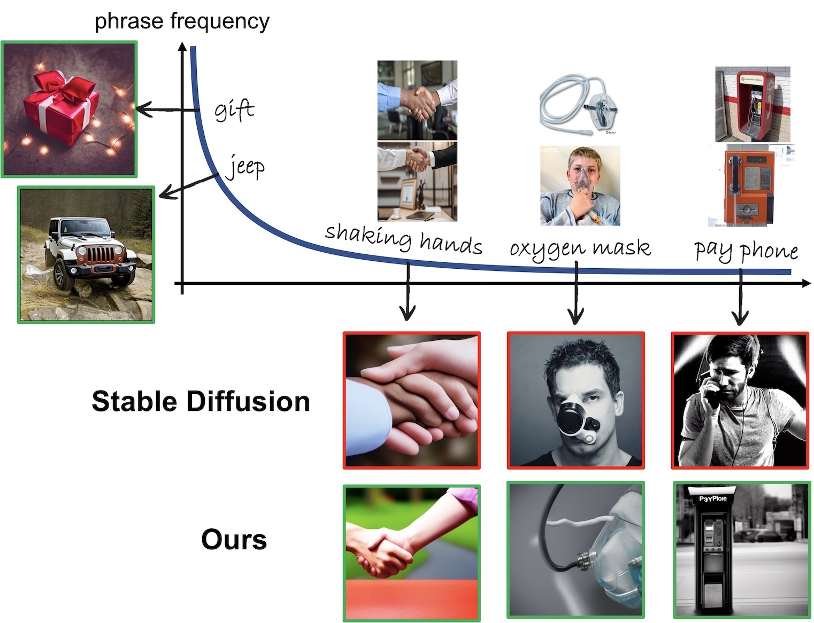
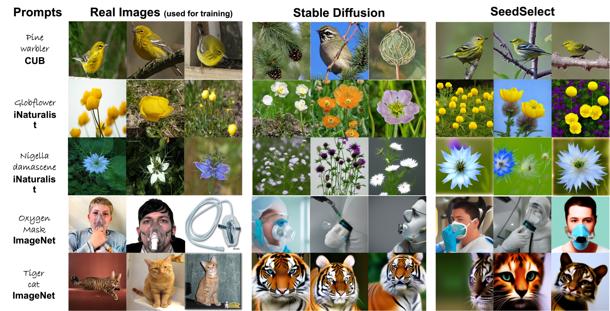
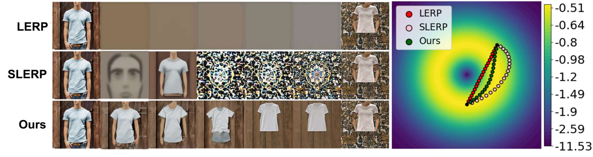
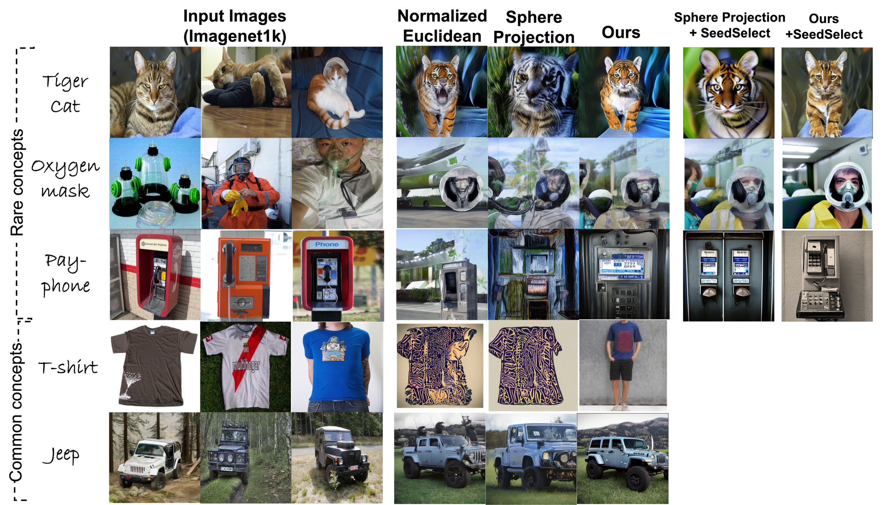

# Code for *"Generating images of rare concepts using pre-trained diffusion models"* (AAAI 24) and *"Norm-guided latent space exploration for text-to-image generation"* (NeurIPS 23)

## Generating images of rare concepts using pre-trained diffusion models (AAAI 24)

> Dvir Samuel, Rami Ben-Ari, Simon Raviv, Nir Darshan, Gal Chechik  
> Bar-Ilan University, OriginAI, NVIDIA Research

> 
>
> Text-to-image diffusion models can synthesize high-quality images, but they have various limitations. Here we highlight a common failure mode of these models, namely, generating uncommon concepts and structured concepts like hand palms. We show that their limitation is partly due to the long-tail nature of their training data: web-crawled data sets are strongly unbalanced, causing models to under-represent con- cepts from the tail of the distribution. We characterize the effect of unbalanced training data on text-to-image models and offer a remedy. We show that rare concepts can be correctly generated by carefully selecting suitable generation seeds in the noise space, using a small reference set of images, a technique that we call SeedSelect. SeedSelect does not require retraining or finetuning the diffusion model. We assess the faithfulness, quality and diversity of SeedSelect in creating rare objects and generating complex formations like hand im- ages, and find it consistently achieves superior performance. We further show the advantage of SeedSelect in semantic data augmentation. Generating semantically appropriate images can successfully improve performance in few-shot recognition benchmarks, for classes from the head and from the tail of the training data of diffusion models.

<a href="https://arxiv.org/abs/2304.14530"></a>
<a href="https://chechiklab.biu.ac.il/~dvirsamuel/SeedSelect/"></a>

<p align="center">
  
<br>

Text-to-image diffusion models fail to generate images of rare concepts.
Our novel method, SeedSelect, improves generation of all uncommon and ill-formed concepts. It operates by learning a generation seed from just a few training samples.
</p>

### Setup

#### Hugging Face Diffusers Library
Our code relies on Hugging Face's [diffusers](https://github.com/huggingface/diffusers) library for downloading the Stable Diffusion v2.1-base model.
See [Stable Diffusion v2-1-base Model Card](https://huggingface.co/stabilityai/stable-diffusion-2-1-base) for more details.


### Usage

<p align="center">
  
<br>
Example generations outputted by Stable Diffusion vs SeedSelect. 
</p>

To generate an image, you can simply run the `main.py` script:
```
python main.py <method> <prompt> <dir>
```
**method:** _StableDiffusion_ or _SeedSelect_    
**prompt:** The name of the rare concept.   
**dir:** Path to the directory of images

For example, run the following command to optimize the seed for the rare concept "tiger cat":    
```
python main.py SeedSelect tiger_cat imgs/tiger_cat
```

Note that SeedSelect might be sensitive to the provided images and hyper-parameters. Furthermore, it might take more than 30 iterations (~5 minutes) to converge.
For a faster convergence, use Norm-aware optimization for SeedSelect, described below.


## Norm-guided latent space exploration for text-to-image generation

> Dvir Samuel, Rami Ben-Ari, Nir Darshan, Haggai Maron, Gal Chechik  
> Bar-Ilan University, OriginAI, NVIDIA Research

> 
>
> Text-to-image diffusion models show great potential in synthesizing a large variety of concepts in new compositions and scenarios. However, their latent seed space is still not well understood and has been shown to have an impact in generating new and rare concepts.  Specifically, simple operations like interpolation and centroid finding work poorly with the standard Euclidean and spherical metrics in the latent space. This paper makes the observation that current training procedures make diffusion models biased toward inputs with a narrow range of norm values. This has strong implications for methods that rely on seed manipulation for image generation that can be further applied to few-shot and long-tail learning tasks. To address this issue, we propose a novel method for interpolating between two seeds and demonstrate that it defines a new non-Euclidean metric that takes into account a norm-based prior on seeds. We describe a simple yet efficient algorithm for approximating this metric and use it to further define centroids in the latent seed space. We show that our new interpolation and centroid evaluation techniques significantly enhance the generation of rare concept images. This further leads to state-of-the-art performance on few-shot and long-tail benchmarks, improving prior approach in terms of generation speed, image quality, and semantic content.

<a href="https://arxiv.org/abs/2306.08687"></a>
<a href="https://chechiklab.biu.ac.il/~dvirsamuel/SeedSelect/"></a>

<p align="center">
  
<br>

We propose a novel method, called **NAO (Norm-Aware Optimization)** for interpolating between two seeds. In contrast to Linear
Interpolation (LERP) or Spherical Linear Interpolation (SLERP), we formulate interpolation
as finding a likelihood-maximizing path in seed space according to the aforementioned prior.
</p>

### Usage

<p align="center">
  
<br>
NAO gives a better initialization point to SeedSelect, yielding significantly faster convergence without sacrificing accuracy or image quality.
Rare concepts can be generated in less than 5 optimization steps (~10 sec on a single A100 GPU).  
</p>

Run the following command to optimize the seed for the rare concept "tiger cat":    
```
python main.py NAO_SeedSelect tiger_cat imgs/tiger_cat
```

### Citation
If you use this code for your research, please cite the following work: 
```
@inproceedings{Samuel2023SeedSelect,
      title={Generating images of rare concepts using pre-trained diffusion models},
      author={Dvir Samuel and Rami Ben-Ari and Simon Raviv and Nir Darshan and Gal Chechik},
      year={2024},
      journal={AAAI}
}

@inproceedings{Samuel2023NAO,
      title={Norm-guided latent space exploration for text-to-image generation},
      author={Dvir Samuel and Rami Ben-Ari and Nir Darshan and Haggai Maron and Gal Chechik},
      year={2023},
      journal={NeurIPS}
}
```
